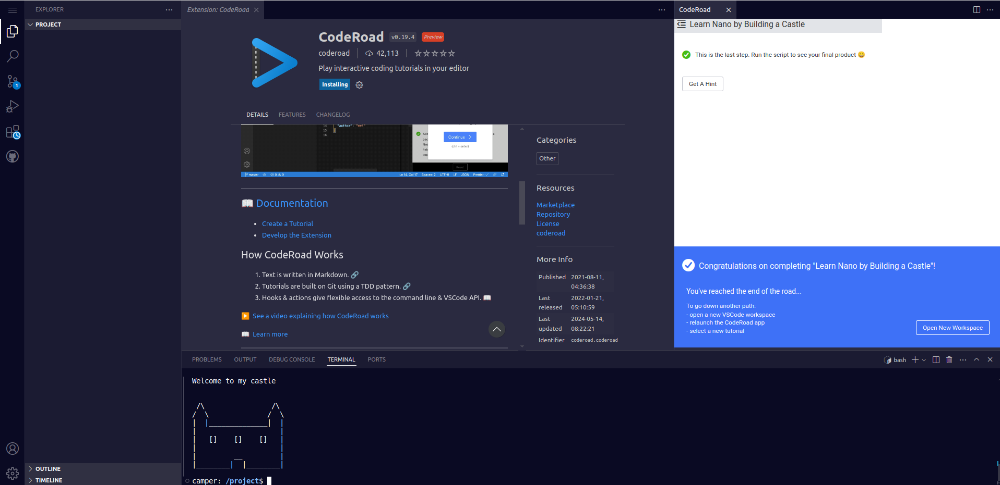

# Build-a-Castle

In this 40-lesson course, you will learn how to edit 
files in the terminal with Nano while building a castle.

#### screenshot cover image

Thank's for this chalenge Freecodecamp
